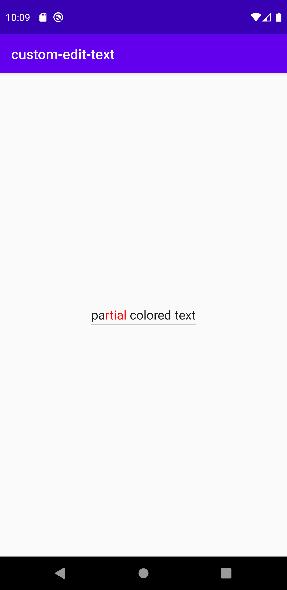

# References:
1. The "box" refers to some place where
you can type something. Like an `EditText`

# Thoughts

So, the idea is to be able

1. to type some text in the box
2. when typing "@", we should be able to choose
from a list of suggestions to put that content
into the box.
3. The items are normal strings. They can contain
spaces though. Later, the items will be complex -
with string, image. So, the view of the list and
the list items should be customizable
4. And when the item is selected - only then it is
put in the box. Otherwise not. 
5. When the item is put in the box, it should be
highlighted in some color (text color, not background)

---
First Attempt:
1. So I tried the `MultiAutoCompleteTextView`. Tried the example here

https://developer.android.com/reference/android/widget/MultiAutoCompleteTextView.html

I'm able to type stuff and I'm able to see some suggestions sometimes.
Suggestions for country names. Like `Belgium`, `Spain` and more from
the list I had already provided. I can see suggestions at the start
of the box - like when there is no text, but just spaces may be.
More like this

This gave suggestions -

```
Be
```

This too -

```
      be
```

But not this. Since it was only one character -

```
B
```

The below too didn't give suggestions. I think this was because
there were other words before.

```
okay okay okay bel
```

I see that we have some tokens and tokenizing concept and in my case
it's a comma tokenizer

```
textView.setTokenizer(MultiAutoCompleteTextView.CommaTokenizer())
```

so, I can see suggestions when I type command `,`. Like this below,
I get suggestions for the second `be`

```
okay okay okay bel, be
```

Demo video:
https://www.youtube.com/watch?v=j3rLYAs4mvk

---
From the first attempt, I'm trying to understand when the suggestions
are shown. Looks like the suggestions are shown based on the tokenization
concept. I can see there's a comma tokenizer and I also see an interface
for the tokenizer

```
public static interface Tokenizer {
    /**
     * Returns the start of the token that ends at offset
     * <code>cursor</code> within <code>text</code>.
     */
    public int findTokenStart(CharSequence text, int cursor);

    /**
     * Returns the end of the token (minus trailing punctuation)
     * that begins at offset <code>cursor</code> within <code>text</code>.
     */
    public int findTokenEnd(CharSequence text, int cursor);

    /**
     * Returns <code>text</code>, modified, if necessary, to ensure that
     * it ends with a token terminator (for example a space or comma).
     */
    public CharSequence terminateToken(CharSequence text);
}
```

I checked the code for comma tokenizer's `findTokenStart` method.
After checking code and the above docs, looks to me like this is
what it is -

`findTokenStart` takes a sequence of characters (like a string),
and a cursor offset, more like the index in a string. The cursor
(the index) is at the end of a token, and now, with this information,
you need to find the start of the token, the index of the start
of the token in the sequence. That's what `findTokenStart` is about

In the case of comma tokenizer's method I can see that the text
is traversed backwards to reach just after the previous comma,
as comma is the token separator I guess. And then the spaces
after that index are ignored and then we land at the start
of the token. The implementation -

```
public int findTokenStart(CharSequence text, int cursor) {
    int i = cursor;

    while (i > 0 && text.charAt(i - 1) != ',') {
        i--;
    }
    while (i < cursor && text.charAt(i) == ' ') {
        i++;
    }

    return i;
}
```

Similarly I checked the code for `findTokenEnd` method in comma tokenizer.
This time the cursor is at the start of the token, the start index,
and we gotta find the end of the token, the end index. Looking at
comma tokenizer's implementation, it looks like the index of the
`,` is what is sent and not the character before the `,`. Interesting.


```
public int findTokenEnd(CharSequence text, int cursor) {
    int i = cursor;
    int len = text.length();

    while (i < len) {
        if (text.charAt(i) == ',') {
            return i;
        } else {
            i++;
        }
    }

    return len;
}
```

Finally I checked the `terminateToken` method too, in comma tokenizer.
This one helps in putting a token terminator character to a token, if one
does not exist. The code is mostly simple except for one part which I didn't
get. Something about `Spanned` and `SpannableString`. Not sure why it's needed.
I'm hoping I don't need it, so not gonna look more into. I think I can handle it
if I face issues later, regarding that.

```
public CharSequence terminateToken(CharSequence text) {
    int i = text.length();

    while (i > 0 && text.charAt(i - 1) == ' ') {
        i--;
    }

    if (i > 0 && text.charAt(i - 1) == ',') {
        return text;
    } else {
        if (text instanceof Spanned) {
            SpannableString sp = new SpannableString(text + ", ");
            TextUtils.copySpansFrom((Spanned) text, 0, text.length(),
                                    Object.class, sp, 0);
            return sp;
        } else {
            return text + ", ";
        }
    }
}
```

The part I didn't understand was why was this line needed -

```
TextUtils.copySpansFrom((Spanned) text, 0, text.length(),
                                    Object.class, sp, 0);
```

Especially when we already have created `sp` already with this line,
which looks good to me.

```
SpannableString sp = new SpannableString(text + ", ");
```

Like I said, I'll come back to it later in case of any issues.

---
Now, I'm planning to create a tokenizer of my own! The plan is to
show suggestions when `@` is typed! :) And to indicate the end of
a token, I'm going to use the character `US` - `Unit Separator`
that me and my friend recently saw in this code base

https://github.com/hootsuite/nachos

Let's see how this tokenizer thing goes! :)

Gonna first copy the comma tokenizer! ;)

Okay, I copied and made some changes. It looks weird now
actually. Lol :P

Demo
https://youtu.be/KA8S2orq8NQ

So, that was the second attempt
---

Clearly, we can see some weird character at the end of
the token when choosing from the list. Also, we can
see suggestions at the start with no @. I think I know
the reason for both. Need to see how to fix it though

---

Third attempt

Let's try to fix the issues that we just noticed.

So, the first issue was - seeing suggestions while
starting to type, even when no `@` was given.
I "think" this was because of the fact that the
`findTokenStart` returned `0` even when there
was no `@` at the start and it started giving
suggestions. So, I made sure I returned the
`cursor` value as is, if no `@` was found
anywhere, till the start, including the
index `0`.

So, this fixed one bug! :)

---

For future reference : 

https://developer.android.com/reference/kotlin/androidx/appcompat/widget/AppCompatMultiAutoCompleteTextView

---

Continuing Third attempt

Need to fix the weird character issue. This is because I'm trying
to use this ASCII character - "US", which is short for Unit Separator",
and it's integer code is `31`, and I'm trying to use this character
as the token end, because I didn't want it to be a space - as
the token itself can contain spaces. And this character - I chose
by checking https://github.com/hootsuite/nachos library, somewhere
in it's code we saw it. Apparently this character cannot be printed. Funnily,
in our case, it's trying to get printed and then shows some weird
symbol as it's a non-printable character and hence I think this
behavior. I need to see how to fix this! :)

First I was guessing if the `SpannableString` and stuff is the issue,
because I do remember seeing some crashes when I messed up the tokenizer
code at times 🙈 I really need to write some tests and stop doing manual
testing! Probably use some automation tool!

Anyways, I tried adding whatever the `SpannableString` code was and it
still didn't work. Later, I got rid of it.

What actually worked was this - this time I used the ASCII character
code 3 - which corresponds to the character called `ETX` or `End of Text`
and it is also a non-printable character. I used it and it worked!!! :D

I also added some strings which are substrings of other strings in my
list. More like, `Karuppiah Natarajan` along with `Karuppiah`. I wanted
to support names or strings with spaces, for the future.

Demo video:
https://youtu.be/21whJXzKRlI

---
Fourth attempt

Now, in the next attempt, I want to highlight the string with some
color when it's chosen from the suggestions. Or else not highlight!
Actually, highlight means background usually, here I mean, highlight
with text color. Or may be both - text color and background color.
If that's possible :) I think it might be ;)

Okay, so this is what I found out -

https://stackoverflow.com/questions/10242274/assigning-text-color-to-text-in-edittext

Looks like I really need to read about this `SpannableString` 😅
Gotta get down to work to consume and read some content about it!

I just tried the example code in the stackoverflow code. First it
felt like it didn't work, only to realize I couldn't see the blue
colored text properly 🤣 and only two characters were colored.
So, the first thing I did was change the color to red and colored
some more characters. This is how it looked then



For highlighting, I was actually thinking of using the fact that
all the mentions start with @ and end with ETX character. The only
problem is that - someone could type @ and not choose from the list,
so, no ETX character will be put. But that's okay, we can still find
chunks of text between @ and ETXs, and leave out lonely @. But the
problem arises when there can be lonely ETXs too! Now there's a
match between the lonely @ where user didn't choose from list
and lonely ETXs too. Does this affect us? Lonely @ and ETXs?
Gotta check. Also, how does lonely ETX come you ask? Like this -
what happens when user goes in between a selected item, a
mention and types in it. Suggestions are again shown and if you
choose it, it's replaced and the existing text on the right
of the mention goes farther away to the right and the current
mention is auto completed. More like

"@Karuppiah <cursor>Natarajan"

And then auto suggestions show up and choosing "Karuppiah Natarajan" will lead to

"@Karuppiah Natarajan <cursor>Natarajan"

Let's just try to highlight the characters first. Let's see how to solve that problem later
I guess?

Okay, for the past hour or so I have been trying to read about spans and how to properly use
them and all and thinking about all the possible problems - basically me trying to get
it right the first time - which is gonna take a lot of time - and may not work too. So I
think I should really dive in and stop thinking so much! 🙈

So, my idea is to implement a CustomMultiAutoCompleteTextView which will watch for
text changes and then highlight the text! :)

and the plan was to set markup so that I can just color the text for the mentions
and if something changes - just remove the markup. for removing markup I was checking
how to do it with removeSpan - there was some method called getSpans and I wasn't sure
if I'll be able to make it work - like I needed a spannable string and it's not me
who sets the textview text, and I wasn't sure how that's gonna workout and all. I guess
I just gotta do it and dig in and see how it all goes

https://stackoverflow.com/questions/18009552/how-to-use-removespan-on-android-textview

also, I just noticed that there's a clearSpans method ;) may be I don't need to getSpans to
remove it, instead just use clearSpans. Let's see

The current idea is to first find out where all spans need to be put - and then
clear and put the spans immediately! :) The only worry is - will there be any glitches
of sorts is the question. Especially because people could be typing while I'm doing all
this processing. I don't know how that's gonna work. Hmm. This feels like a lot of processing,
yeah

Cool. So the idea that I had - nothing worked 🙈 Damn.

Okay wait!!!!! WOW! So what I tried, finally worked!!!!! :D :D :D I mean, I saw this code
that my friend shared. There also something similar was being done - changing text span
onTextChanged using a watcher. I was wondering why it didn't work for me - I removed
my clearSpans method call and it worked. Lol 🙈 😂 Should have just used removeSpan
one by one after getting all spans using getSpans ! That's what I finally did. Still
some bugs around. Gotta fix them up! :D

Currently, I can see highlight for the words, yes! :) That's a good start! And I see
highlights only for selected text. There's still one or two bugs around that. Need
to write tests for it I think!

Okay, so I fixed the bug by reading through code and some experimentation 🙈 😅
Seriously need to write the tests. Hmm. Need to learn how to write tests in Java / Kotlin.
I mean, the directory structure and all. May be intellij can help with that, with the
toggle to test file feature. Hmm. I could put a test for the functionality that gets
the indices of the start and end of all the mentions! :)

Now the only thing left out is - don't allow user to mess up with the mention input, just
allow user to delete the mention

Btw, I struggled a lot for this implementation - I mean, I think simplicity is key and I tried
really hard to keep the code very small and write very less code and only code that I understand to
some extent and some simple implementation

I think there could be a better way too. More optimized and what not. But this is a good start! :D

Demo:
https://youtu.be/Po7ezE0Itag

---
Fifth attempt

Don't allow user to modify (delete partially, adding characters) mention text alone,
but allow user to delete mention text completely - and not partially like mentioned before.


